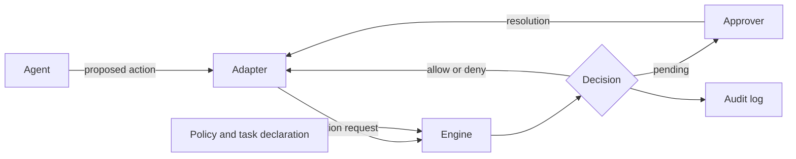

<<<<<<< HEAD
# Shiin

Shiin is an agent-agnostic authorization layer for AI agent actions.
It is designed to sit between AI agents (Claude Code, Codex CLI, Cursor, MCP clients, and custom agents) and the files, commands, networks, and services they act on.
For every action an agent proposes, Shiin decides with explicit, deterministic policy whether to `allow` it, `deny` it, or hold it as `pending` until a human approves it, and it records tamper-evident evidence of that decision.
One policy applies to every agent, and no decision ever depends on the output of a language model.

> [!IMPORTANT]
> **Pre-alpha: specification phase.**
> Shiin has no product code and no releases, so there is nothing to install or run yet.
> This repository contains the design: documentation, specifications, architecture decision records, and a small Rust tool that checks the documentation.
> Everything this README says about Shiin's behavior describes the intended design.

## The problem in 30 seconds

AI coding agents act with the authority of the person who runs them.
An agent that can edit files can also delete them, an agent that can run tests can run any command, and an agent that can fetch documentation can send data to any host the machine can reach.
Agents make mistakes, they can be manipulated by instructions hidden in the text they read, and they usually have far more access than the task needs.
OWASP lists that last risk as [LLM06:2025 Excessive Agency](https://genai.owasp.org/llmrisk/llm062025-excessive-agency/).

Each agent host ships its own controls, but those controls are configured separately for every agent, do not know the task, leave little evidence, and rarely say how strong their protection is.

Consider the instruction "Fix the login bug. Do not change the database schema."
The agent is allowed to run database commands, so when it decides to add a column, every existing control sees an authorized action.
Only a control that knows the task can see that the action contradicts the instruction.
Shiin is designed to be that control.

## How it works

An adapter intercepts each action an agent proposes, the engine evaluates it against policy and the active task, and the resulting decision is enforced, sent to a human when it is `pending`, and recorded.

1. **Intercept.** An adapter receives the proposed action from the host, for example through a hook,
   and normalizes it into a host-independent action request.
2. **Evaluate.** The engine runs five stages in a fixed order: identity, capability, policy, intent, and risk.
   A `deny` from any stage wins, and when no rule matches, the decision is `deny`.
3. **Enforce.** The adapter returns the decision in the host's own protocol.
   Errors and timeouts produce `deny`.
4. **Approve.** A `pending` action waits for a human approver, who can allow it once or create a scoped grant.
   A grant never overrides `deny`.
5. **Record.** Every decision is written to a hash-chained audit log, which is tamper-evident but not tamper-proof.

Shiin decides whether an action should happen.
A sandbox limits the damage if something runs anyway, so the two are meant to be used together.
[How Shiin works](docs/concepts/how-shiin-works.md) walks through the flow with examples, and [Limitations](docs/concepts/limitations.md) explains what Shiin cannot see.

## What makes Shiin different

Several open-source projects already intercept agent actions, and the [landscape](docs/overview/landscape.md) credits them.
Shiin's contribution is the combination of four things:

1. **Task-intent binding.**
   Actions are checked against the constraints of the task the developer confirmed, not only against standing policy.
2. **An open, agent-neutral contract.**
   The [action request](docs/spec/action-request.md), [decision](docs/spec/decision.md), and [approval protocol](docs/spec/approval-protocol.md) are versioned specifications with schemas and test vectors that other tools can implement.
3. **Analyzable policy.**
   Policies are planned to compile to [Cedar](https://github.com/cedar-policy/cedar), a formally verified authorization language, so they can be tested, explained, and reasoned about.
   This choice is proposed and awaits a spike ([ADR-0014](docs/adr/0014-cedar-policy-engine-with-toml-front-end.md)).
4. **Explicit enforcement levels.**
   Every integration is labeled cooperative, mediated, or OS-enforced, so its protection is never overstated.

## Documentation

The documentation lives in [`docs/`](docs/README.md).
It reads well on GitHub and also builds as a book with mdBook.

| Topic | Start with |
|---|---|
| Orientation | [Documentation home](docs/README.md), [Vision](docs/overview/vision.md), [Use cases](docs/overview/use-cases.md), [FAQ](docs/overview/faq.md) |
| Concepts | [How Shiin works](docs/concepts/how-shiin-works.md), [Limitations](docs/concepts/limitations.md), [Glossary](docs/glossary.md) |
| Comparison | [Landscape](docs/overview/landscape.md) |
| Specifications | [About the specifications](docs/spec/README.md), [Action request](docs/spec/action-request.md), [Evaluation](docs/spec/evaluation.md), [Adapter contract](docs/spec/adapter-contract.md) |
| Security | [Threat model](docs/security/threat-model.md), [Security model](docs/security/security-model.md), [Enforcement levels](docs/security/enforcement-levels.md) |
| Architecture | [Overview](docs/architecture/overview.md), [Deployment models](docs/architecture/deployment-models.md) |
| Engineering | [Workspace and crates](docs/engineering/workspace-and-crates.md), [Coding standards](docs/engineering/coding-standards.md), [Testing strategy](docs/engineering/testing-strategy.md) |
| Decisions | [Architecture decision records](docs/adr/README.md), [RFC process](docs/rfcs/README.md) |
| Project | [Roadmap](docs/project/roadmap.md), [Versioning and stability](docs/project/versioning-and-stability.md), [Documentation style guide](docs/project/docs-style-guide.md) |

## Roadmap

Milestones are defined by capability, not by date.
The project is working on M0.
The [roadmap](docs/project/roadmap.md) lists the scope and exit criteria of each milestone.

| Milestone | Headline |
|---|---|
| M0: Specification | Specifications, threat model, test vectors, and the policy-engine spike |
| v0.1: Gate | Claude Code adapter with policy, basic risk signals, and an audit log |
| v0.2: Tasks | Task declarations and intent binding; Codex CLI and Cursor adapters |
| v0.3: Approve | Daemon, approval protocol, and grants |
| v0.4: Evidence | Signed receipts, verification, and replay |
| v0.5: MCP and SDK | MCP proxy, local API, and the Rust client library |
| v0.6: Reach | Remote approvals, streamable-HTTP MCP, shell wrapper, and Windows |
| v1.0: Stable | Frozen specifications, an independent security audit, and a conformance suite |
| After 1.0 | Team policy server, more approver apps, and language bindings |

## Contributing

The specification phase is the cheapest time to change the design, so reviews of the specifications and the threat model are the most useful contributions right now.
Read [CONTRIBUTING.md](CONTRIBUTING.md) before opening a pull request.
Commits need a Developer Certificate of Origin sign-off (`git commit -s`), and all code and tooling are written in Rust.

- Everyone who participates follows the [code of conduct](CODE_OF_CONDUCT.md).
- [GOVERNANCE.md](GOVERNANCE.md) describes how decisions are made, and [MAINTAINERS.md](MAINTAINERS.md) lists who makes them.
- [SUPPORT.md](SUPPORT.md) explains where to ask questions.
- AI coding agents working in this repository follow [AGENTS.md](AGENTS.md).

## Security

A way to get an action past Shiin's decisions is a security vulnerability, even in a specification.
Report vulnerabilities privately as described in [SECURITY.md](SECURITY.md), never in a public issue.

## License

Shiin is licensed under the [Apache License, Version 2.0](LICENSE).
See [NOTICE](NOTICE) for attribution.
Contributions are accepted under the same license with a DCO sign-off and no contributor license agreement ([ADR-0004](docs/adr/0004-apache-2-license-and-dco.md)).
=======
<!-- shiin-doc: kind=index status=draft implementation=none milestone=m0 reviewed=2026-09-14 -->

# Shiin documentation

> [!NOTE]
> **Project status: pre-alpha.**
> Shiin is in its specification phase.
> No code has been released, and nothing described in this documentation can be installed or run yet.

Shiin is an agent-agnostic authorization layer for AI agent actions.
It sits between AI agents (Claude Code, Codex CLI, Cursor, MCP clients, and custom agents)
and the things they act on: files, commands, networks, and services.
For every action an agent proposes, Shiin decides whether to allow it, deny it,
or hold it for a human to approve, and it records evidence of that decision.

Shiin's decisions are made by explicit, deterministic policy, never by a language model.
Policies are written once and apply to every agent.
Policies can also be bound to the specific task a developer gave the agent,
so an action can be refused because it does not belong to that task, even if it would otherwise be allowed.

## What exists, what is specified, and what is planned

| State | What it covers |
|---|---|
| **Exists today** | This documentation, the architecture decision records, the JSON Schemas and test vectors under `spec/`, and the repository's documentation tooling |
| **Specified** | The [action request](spec/action-request.md), [decision](spec/decision.md), [evaluation](spec/evaluation.md), [policy model](spec/policy-model.md), [intent binding](spec/intent-binding.md), [approval protocol](spec/approval-protocol.md), [audit events](spec/audit-events.md), [receipts](spec/receipts.md), [adapter contract](spec/adapter-contract.md), and [local API](spec/local-api.md) |
| **Planned** | Every command, adapter, daemon, and library; see the [roadmap](project/roadmap.md) for what each milestone delivers |

## Start here

| If you are | Read, in order |
|---|---|
| New to Shiin | [Vision](overview/vision.md), [How Shiin works](concepts/how-shiin-works.md), [Use cases](overview/use-cases.md), [Limitations](concepts/limitations.md) |
| Evaluating Shiin's security | [Threat model](security/threat-model.md), [Security model](security/security-model.md), [Enforcement levels](security/enforcement-levels.md), [Limitations](concepts/limitations.md) |
| Comparing Shiin with other tools | [Landscape](overview/landscape.md), [FAQ](overview/faq.md) |
| Building an adapter or integration | [Adapter contract](spec/adapter-contract.md), [Action request](spec/action-request.md), [Decision](spec/decision.md), [Local API](spec/local-api.md) |
| Planning to write policy | [Policies](concepts/policies.md), [Policy model](spec/policy-model.md), [Writing policies](guides/writing-policies.md) |
| Contributing code | [Workspace and crates](engineering/workspace-and-crates.md), [Coding standards](engineering/coding-standards.md), [Testing strategy](engineering/testing-strategy.md), [CONTRIBUTING.md](https://github.com/BAGOMBEKA-JOB-DEV/shiin/blob/main/CONTRIBUTING.md) |
| Proposing a change | [ADR index](adr/README.md), [RFC process](rfcs/README.md) |

## Reading the status banners

Every page starts with a banner that says what kind of page it is and how settled its content is.

- **Specification** pages are normative contracts. Implementations will be tested against them.
- **Design document** pages explain the intended design and the reasons behind it.
- **Design intent: not implemented** pages describe what using Shiin will look like.
  They are written ahead of the code so the experience can be reviewed before it is built.
  Nothing on those pages works yet.
- **Architecture decision** pages record one decision and its status.
- **Project policy** pages set rules for the project and its contributors.

The [documentation style guide](project/docs-style-guide.md) defines every label and the checks that keep banners accurate.

## Giving feedback

The specification phase is the cheapest time to change the design.

- For a problem in a specification, open an issue using the spec feedback form.
- For anything that might be a way to bypass Shiin, do not open a public issue.
  Follow [SECURITY.md](https://github.com/BAGOMBEKA-JOB-DEV/shiin/blob/main/SECURITY.md) instead.
- For larger changes, read the [RFC process](rfcs/README.md).
>>>>>>> 31d2eb34b04abdee3b26c79baf618924101d35ae
