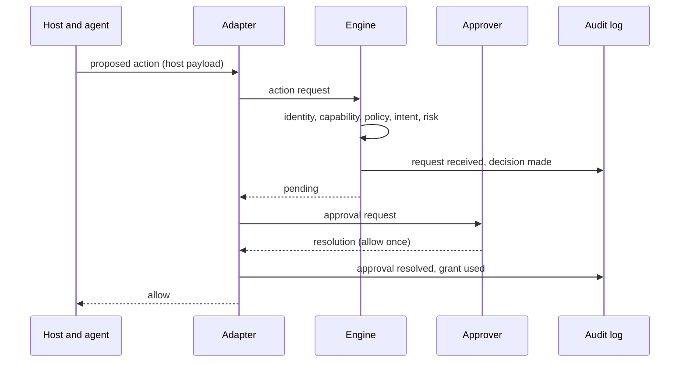

<!-- shiin-doc: kind=explanation status=draft implementation=none milestone=m0 reviewed=2026-10-01 -->

# Decision pipeline

> [!NOTE]
> **Design document: draft.**
> Describes the intended design. No implementation exists yet.

The decision pipeline is the path an [action](../glossary.md#action) takes from proposal to enforcement.

## Steps

1. **Intercept.** An [adapter](../glossary.md#adapter) receives the proposed action from the host.
2. **Normalize.** The adapter builds an [action request](../spec/action-request.md).
3. **Evaluate.** The [engine](../glossary.md#engine) runs five stages in order: identity, capability, policy, intent, and risk.
4. **Decide.** The engine produces a [decision](../spec/decision.md): `allow`, `deny`, or `pending`.
5. **Enforce.** The adapter returns the decision in the host's own protocol.
6. **Record.** An [audit event](../spec/audit-events.md) is written.

## Stage order

Later stages can only make the result stricter.
The identity, capability, intent, and risk stages are [gates](../glossary.md#gate): they can stop or hold an action but never allow it.
Only a policy rule, or a [grant](../glossary.md#grant) created by an approver, can produce `allow`.

## Failure

Any failure produces `deny` ([ADR-0013](../adr/0013-fail-closed-failure-semantics.md)).

## Diagram

## Read next

- [How Shiin works](../concepts/how-shiin-works.md)
- [Evaluation](../spec/evaluation.md)