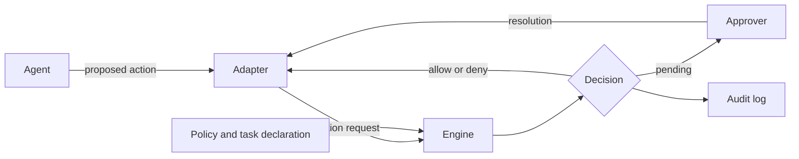

<!-- shiin-doc: kind=explanation status=draft implementation=none milestone=m0 reviewed=2026-10-01 -->

# Architecture overview

> [!NOTE]
> **Design document: draft.**
> Describes the intended design. No implementation exists yet.

Shiin is a local, agent-agnostic authorization layer for AI agent actions.
It sits between agents and the files, commands, networks, and services they act on.

## Components

## Engine

The [engine](../glossary.md#engine) is the pure, synchronous component that evaluates an [action request](../spec/action-request.md) against a [policy snapshot](../glossary.md#policy-snapshot) and returns a [decision](../spec/decision.md).
It performs no I/O ([ADR-0010](../adr/0010-pure-synchronous-engine.md)).

## Adapters

An [adapter](../glossary.md#adapter) connects a [host](../glossary.md#host) to Shiin.
It intercepts proposed actions, builds action requests, and enforces the resulting decision using the host's own protocol.
Adapters never make decisions.

## Audit log

The [audit log](../glossary.md#audit-log) is an append-only JSON Lines file of [audit events](../spec/audit-events.md) linked by a hash chain.
It is tamper-evident, not tamper-proof.

## Crates

The component map is described in [Workspace and crates](../engineering/workspace-and-crates.md).
The engine crates are `shiin-schema`, `shiin-classify`, `shiin-policy`, and `shiin-engine`.

## Deployment

Shiin is local-first and daemonless in v0.1 ([ADR-0022](../adr/0022-local-first-daemonless-deployment.md)).
A per-user daemon is planned for v0.3.
See [Deployment models](deployment-models.md).

## Read next

- [Decision pipeline](decision-pipeline.md)
- [Deployment models](deployment-models.md)
- [State and storage](state-and-storage.md)