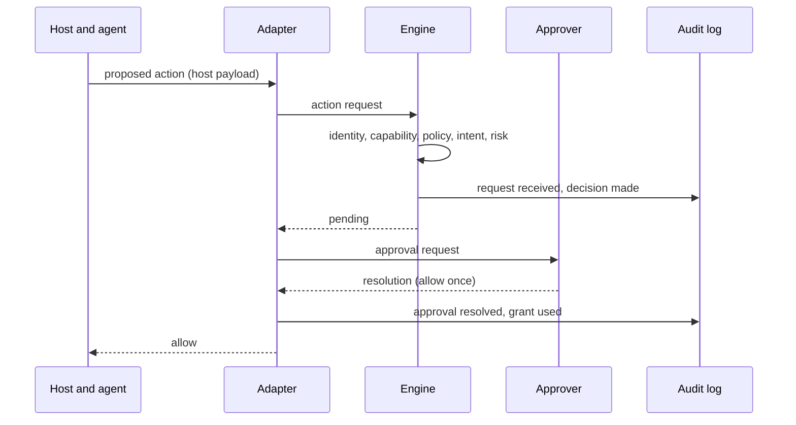
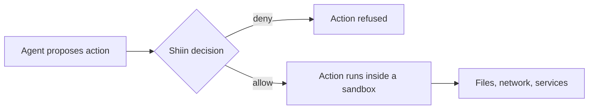

<!-- shiin-doc: kind=explanation status=draft implementation=none milestone=v0.1 reviewed=2026-09-14 -->

# How Shiin works

> [!NOTE]
> **Design document: draft.**
> Describes the intended design. No implementation exists yet.
> The [specifications](../spec/README.md) are the precise source for everything summarized here.

This page follows one action from the moment an agent proposes it to the moment it is recorded,
then walks through four concrete examples.

## The path of one action

1. **The agent proposes an action.**
   The agent, running inside a [host](../glossary.md#host) such as Claude Code, decides to run a command, edit a file, or call a tool.
2. **An adapter intercepts it.**
   Before the host executes the action, the host hands it to a Shiin [adapter](../glossary.md#adapter), for example through a [hook](../glossary.md#hook).
3. **The adapter normalizes it.**
   The adapter turns the host's payload into an [action request](../spec/action-request.md):
   which agent is asking, what [action type](../spec/action-types.md) it is, what resources it touches,
   what its [effects](../glossary.md#effect) are, and which task is active.
   Anything the adapter cannot classify is marked [opaque](../glossary.md#opaque-effect).
4. **The engine evaluates it.**
   The [engine](../glossary.md#engine) takes the action request and a [policy snapshot](../glossary.md#policy-snapshot)
   and runs five [stages](#the-five-stages) in a fixed order.
5. **A decision comes back.**
   The [decision](../spec/decision.md) is `allow`, `deny`, or `pending`, with a [reason code](../glossary.md#reason-code) and a message for the agent.
6. **The adapter enforces it** in the host's own protocol.
   For a hook, that means returning the host's allow or deny response.
   For `pending`, it means asking an [approver](../glossary.md#approver) and waiting, or using the host's native prompt,
   or [denying with a ticket](../glossary.md#deny-with-ticket) when the host cannot wait.
7. **An audit event is written** to the [audit log](../spec/audit-events.md) before a non-read action is allowed to proceed.

The following sequence diagram shows the same flow when a decision needs approval.



## The five stages

Stages run in this order. Later stages can only make the result stricter.

| Stage | Question it answers | Can return |
|---|---|---|
| Identity | Do we know which agent is asking, and how sure are we? | `deny`, `pending`, or pass |
| Capability | May this agent attempt this class of action at all? | `deny`, `pending`, or pass |
| Policy | What do the rules say about this action on these resources? | `allow`, `deny`, or `pending` |
| Intent | Does the action fit the constraints of the active task? | `deny`, `pending`, or pass |
| Risk | Does the action have a risk signal that needs escalation? | `deny`, `pending`, or pass |

Identity, capability, intent, and risk are [gates](../glossary.md#gate): they can stop or hold an action but never allow it.
Only a policy rule, or a [grant](../glossary.md#grant) created by an approver, can produce `allow`.

The results combine in a fixed way, specified in [Evaluation](../spec/evaluation.md):

- If any stage returns `deny`, the decision is `deny`.
- Otherwise, if any stage returns `pending`, the decision is `pending`, unless a matching grant already covers it.
- Otherwise, if a policy rule allows the action, the decision is `allow`.
- Otherwise, the decision is the [default decision](../glossary.md#default-decision), which is `deny`.

## Four examples

The examples use this policy, written in the TOML format specified in [Policy syntax](../spec/policy-syntax.md).
The syntax shown here is illustrative until that specification is accepted.

```toml
# .shiin/policy.toml (illustrative)
[[rule]]
id = "edit-source"
effect = "allow"
actions = ["fs.read", "fs.write", "fs.create"]
resources = ["./src/**", "./tests/**"]

[[rule]]
id = "no-secrets"
effect = "deny"
actions = ["fs.read"]
resources = ["**/.env", "**/.env.*", "~/.ssh/**"]
reason = "Secret files are not readable by agents."

[[rule]]
id = "run-tests"
effect = "allow"
actions = ["shell.exec"]
commands = ["cargo test", "cargo nextest run"]
```

### 1. An allowed edit

The agent edits `src/login.rs` inside the workspace.

- The adapter builds an action request with action type `fs.write` and one effect: an exact write to `/home/dev/project/src/login.rs`.
- Identity and capability pass. The `edit-source` rule allows the write.
- No task is active, and no risk signal applies.
- The decision is `allow`. An audit event is written, and the host proceeds.

### 2. A denied read of a secret

The agent tries to read `.env` to "check the configuration".

- The action request has action type `fs.read` on `/home/dev/project/.env`.
- The `no-secrets` rule matches and returns `deny`. The `edit-source` rule does not matter, because `deny` wins.
- The decision is `deny` with reason code `deny.policy`.
- The agent receives the rule's reason, which says what is refused without revealing the rest of the policy.

### 3. A command whose effects are unknown

The agent runs `python scripts/cleanup.py`.

- The classifier recognizes a Python interpreter running a script. It cannot know what the script will do,
  so the action request carries an [opaque effect](../glossary.md#opaque-effect).
- No rule allows the command, and the opaque effect raises the `opaque_command` [risk signal](../spec/risk-signals.md).
- The decision is `pending` with reason code `pending.opaque`.
- In v0.1, the adapter uses Claude Code's native permission prompt.
  From v0.3, the request goes through the [approval protocol](../spec/approval-protocol.md), and an approver can allow it once.

This example also shows a limit: once the script is allowed, Shiin does not see what it does.
[Limitations](limitations.md) explains why, and [Using Shiin with sandboxes](../guides/using-shiin-with-sandboxes.md) explains how to cover that gap.

### 4. An action outside the task

The developer declares a task before handing work to the agent (planned: v0.2):

```toml
# task declaration (illustrative)
description = "Fix the login bug"
scope.paths = ["./src/auth/**", "./tests/auth/**"]
forbid.action_types = ["db.schema_change"]
expires_at = "2026-09-14T18:00:00Z"
```

The agent then tries to create `migrations/0042_add_login_attempts.sql`.

- The `edit-source` rule would not allow this path anyway, but suppose the operator's policy allowed writes anywhere in the workspace.
- The intent stage checks the task's `scope.paths` constraint. The path is outside it.
- The decision is `deny` with reason code `deny.intent`, even though standing policy allowed the write.

If the agent instead ran `psql -c "ALTER TABLE users ADD COLUMN login_attempts int"`,
the SQL classifier (planned: v0.5) would identify a `db.schema_change` effect,
and the `forbid.action_types` constraint would deny it the same way.

## Where Shiin sits relative to a sandbox

Shiin and a sandbox answer different questions, and they work best together.
Shiin decides before an action whether it should happen at all.
A sandbox limits what can happen if an allowed action, or code it runs, misbehaves.



## What exists today

Nothing on this page is implemented yet.
The [roadmap](../project/roadmap.md) lists the milestone that delivers each part.

| Part | Milestone |
|---|---|
| Claude Code adapter, engine, policy, audit log | v0.1 |
| Task declarations and intent binding | v0.2 |
| Approval protocol and grants | v0.3 |
| Receipts and replay | v0.4 |
| MCP proxy and SQL classifiers | v0.5 |

## Read next

- [Action requests](action-requests.md)
- [Decisions](decisions.md)
- [Limitations](limitations.md)
