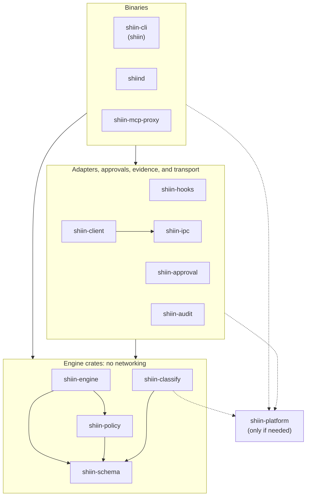

<!-- shiin-doc: kind=policy status=draft implementation=n/a milestone=n/a reviewed=2026-09-14 -->

# Workspace and crates

> [!NOTE]
> **Project policy: draft.**
> This page is the only home of Shiin's crate list.
> Today the workspace has one member, `xtask`; every other crate on this page is planned.

Shiin is built as a single Cargo workspace.
This page describes the repository layout, the crates the workspace will contain, what each crate is responsible for,
and the rules that keep the crate graph small, acyclic, and honest about what exists.
The decision behind the layout is [ADR-0035](../adr/0035-workspace-layout.md).

## What exists today

| Path | State | Purpose |
|---|---|---|
| `Cargo.toml` | exists | Virtual workspace manifest with shared package metadata, `[workspace.dependencies]`, and `[workspace.lints]` |
| `rust-toolchain.toml` | exists | Pinned toolchain; see [Toolchain and MSRV](toolchain-and-msrv.md) |
| `rustfmt.toml`, `.editorconfig` | exist | Formatting rules; see [Coding standards](coding-standards.md) |
| `.cargo/config.toml` | exists | Defines the `cargo xtask` alias |
| `xtask/` | exists | Repository tooling; today it provides `cargo xtask docs-check` |
| `crates/` | planned | Product crates, each created in the milestone that needs it |
| `fuzz/` | planned: v0.1 | Fuzz targets in a separate workspace |

The workspace section of today's `Cargo.toml` is:

```toml
[workspace]
resolver = "3"
members = ["xtask"]
```

The alias in `.cargo/config.toml` is:

```toml
[alias]
xtask = "run --quiet --package xtask --"
```

## Layout

```text
Cargo.toml             virtual workspace manifest (no root package)
rust-toolchain.toml    pinned toolchain
rustfmt.toml           formatter settings
.editorconfig          editor settings
.cargo/config.toml     cargo aliases, including `cargo xtask`
crates/<name>/         one directory per product crate (planned)
xtask/                 repository tooling, never published
fuzz/                  fuzz targets, a separate nightly workspace (planned: v0.1)
docs/                  this documentation
```

- The root `Cargo.toml` is a virtual manifest.
  It has no `[package]` section, so no crate is privileged by living at the root.
- Product crates live in `crates/<name>/`, and the directory name is the crate name.
- `xtask/` follows the `cargo xtask` convention for repository automation written in Rust.
  It sets `publish = false`.
  Product crates never depend on it.
- `fuzz/` has its own `[workspace]` table and lockfile.
  Its nightly-only dependencies never enter the main workspace, its lockfile, or its MSRV check.
  See [Testing strategy](testing-strategy.md).
- Every member inherits `edition`, `rust-version`, `license`, `repository`, and `authors` from `[workspace.package]`.
- Every member sets `[lints] workspace = true`, except `shiin-platform`, which declares its own table as described in [Coding standards](coding-standards.md).

## Crates

The table lists every crate the project plans, the one responsibility each has, and the [milestone](../project/roadmap.md) in which it is created.
A crate that is listed here but not yet created does not exist in any form, including on crates.io.

| Crate | Responsibility | Milestone |
|---|---|---|
| `shiin-schema` | Wire types for action requests, decisions, approval messages, and audit events, matching the JSON Schemas in `docs/spec/schemas/` | v0.1 |
| `shiin-classify` | Normalizers for paths, shell commands, URLs, and SQL, and the derivation of effects from them | v0.1 (SQL: v0.5) |
| `shiin-policy` | The TOML front-end and its compilation to Cedar, policy layering, and diagnostics | v0.1 |
| `shiin-engine` | The pure, synchronous evaluation pipeline | v0.1 |
| `shiin-audit` | The hash-chained audit log, verification, and replay; receipts behind a feature | v0.1 (receipts: v0.4) |
| `shiin-hooks` | Host hook adapters: a `claude_code` module, then `codex` and `cursor` modules | v0.1 (Codex and Cursor: v0.2) |
| `shiin-cli` | The `shiin` binary: `init`, `check`, `explain`, `policy validate`, `policy test`, `hook`, `task`, `pending`, `approve`, `log`, `verify`, `replay`, and `doctor` | v0.1 |
| `shiin-approval` | The approval state machine and grants | v0.3 |
| `shiin-ipc` | Local transport over Unix domain sockets and Windows named pipes | v0.3 |
| `shiind` | The per-user daemon | v0.3 |
| `shiin-client` | The public Rust client library | v0.5 |
| `shiin-mcp-proxy` | The MCP proxy | v0.5 |
| `shiin-platform` | The only crate allowed to contain `unsafe` code; created only if needed | as needed |
| `xtask` | Repository tooling | exists |
| `fuzz/` | Fuzz targets; a separate workspace, not a member crate | v0.1 |

`shiin-cli` gains its subcommands milestone by milestone; the [CLI reference](../reference/cli.md) says which command arrives when.

The *engine crates* are `shiin-schema`, `shiin-classify`, `shiin-policy`, and `shiin-engine`.
Several rules on this page and on [Async and concurrency](async-and-concurrency.md) apply to that group.

## Rules

### Never pre-create crates

- A crate is created in the pull request that adds its first real functionality, in the milestone the table names.
- Empty, placeholder, or "coming soon" crates are not created, in the repository or on crates.io.
  Crate names are not reserved on crates.io in advance.
- A pull request that adds, splits, merges, or renames a crate updates the table on this page in the same change.
- A change that alters the dependency direction below, or adds a crate to the set of stable public APIs, needs an ADR.

### Stable and internal APIs

- `shiin-schema` and `shiin-client` are the only crates intended to become stable public APIs.
  Other projects may depend on them, and after 1.0 they follow the guarantees in [Versioning and stability](../project/versioning-and-stability.md).
- Every other product crate is published to crates.io, because a published crate can only depend on other published crates,
  but is documented as internal before 1.0.
  Its crate-level documentation starts with a sentence saying that the API is internal to Shiin and can change in any release.
- `xtask` is never published.

### Dependencies are declared once, with default features off

- Every third-party dependency is declared in `[workspace.dependencies]` with a version requirement and `default-features = false`.
- Members reference it with `workspace = true` and enable only the features they use.
- Default features have to be disabled at the workspace level:
  a member can add features to a workspace dependency but cannot remove default features that the workspace entry leaves enabled.
- Admitting a dependency at all is governed by [Dependencies and supply chain](dependencies-and-supply-chain.md).

Today's `Cargo.toml` does not fully follow this rule yet.
`jsonschema` sets `default-features = false`, but the `regex`, `serde_json`, and `walkdir` entries do not.
Those entries are used only by `xtask`, and they are to be brought in line in a follow-up pull request.

### No networking in the engine crates

- The engine crates never open network connections and never depend on crates that do, such as HTTP clients, TLS stacks, or async runtimes.
- `shiin-engine` performs no I/O of any kind ([ADR-0010](../adr/0010-pure-synchronous-engine.md)).
- `shiin-classify` and `shiin-policy` may read the local file system where their job requires it, such as resolving a path or loading a policy file.
- A planned `xtask` check inspects the normal (non-dev) dependency tree of each engine crate and fails if a forbidden crate appears.

### `shiin-engine` builds for WebAssembly as a purity guard

From v0.4, CI builds `shiin-engine` for the `wasm32-unknown-unknown` target on every pull request.

- The build fails if the engine, or anything it depends on, needs operating-system facilities that target lacks,
  such as native system libraries, platform-specific system calls, or an operating-system randomness source.
  That makes it a cheap, continuous guard against I/O and platform dependencies creeping into the engine.
- The guard is not complete.
  The standard library still compiles calls such as file and socket operations for that target and only fails at run time,
  so the build does not catch them.
  Planned `disallowed_methods` and `disallowed_types` Clippy configuration for the engine crates covers that gap.
- The guard starts at v0.4, when [replay](../glossary.md#replay) makes the engine's determinism a guarantee users rely on.
- Building for this target is a test, not a support promise.
  Supported platforms are listed in [Platform support](../reference/platform-support.md).

## Dependency direction

Dependencies point from binaries, through adapters and services, down to the engine crates, and never back up.
`shiin-platform`, if it is ever created, sits below everything that needs it and depends on no other Shiin crate.



The diagram is enforced by these rules:

1. A crate never depends on a crate in a group above it, and libraries never depend on binaries.
2. The engine crates depend only on each other and on third-party crates that satisfy the no-networking rule.
3. `shiin-engine` does not depend on `shiin-classify`.
   [Adapters](../glossary.md#adapter) classify what a host reports into an [action request](../glossary.md#action-request);
   the [engine](../glossary.md#engine) only evaluates action requests.
4. `shiin-client` depends only on `shiin-schema`, `shiin-ipc`, and third-party crates,
   so embedding the public client library never pulls in Cedar or the engine.
5. `shiin-platform` depends on no other Shiin crate.
   `shiin-engine` and `shiin-schema` never depend on it.
6. `xtask` may depend on product crates, for example to validate examples against real types; no product crate depends on `xtask`.

Dependencies within a group are allowed when they respect these rules; Cargo rejects cycles.

## Adding a crate

1. Confirm the crate is in the table for the current milestone, or update the table in the same pull request.
2. Create `crates/<name>/Cargo.toml` inheriting the `[workspace.package]` fields and `[lints] workspace = true`.
3. Write crate-level documentation stating the crate's responsibility and, before 1.0, that its API is internal (unless it is `shiin-schema` or `shiin-client`).
4. Admit each new dependency under [Dependencies and supply chain](dependencies-and-supply-chain.md).
5. If the crate is security-sensitive, add it to [Security-sensitive changes](security-sensitive-changes.md).

## Related pages

- [Architecture overview](../architecture/overview.md) maps components to these crates.
- [Toolchain and MSRV](toolchain-and-msrv.md)
- [Coding standards](coding-standards.md)
- [Unsafe code policy](unsafe-policy.md)
