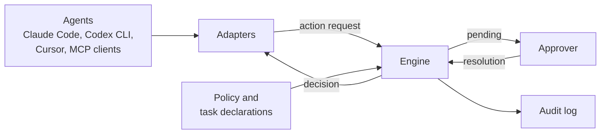

<!-- shiin-doc: kind=explanation status=draft implementation=none milestone=n/a reviewed=2026-09-14 -->

# Vision

> [!NOTE]
> **Design document: draft.**
> Describes the intended design. No implementation exists yet.

## The problem

AI coding agents act with the authority of the person who runs them.
An agent that can edit files can also delete them.
An agent that can run tests can run any command.
An agent that can fetch documentation can send data to any host the developer's machine can reach.

Three things go wrong:

1. **Mistakes.** A model misreads a request and deletes the wrong directory, drops the wrong database, or force-pushes over a colleague's work.
2. **Manipulation.** Text the agent reads (a web page, an issue, a dependency's README, an MCP tool description) contains instructions the agent follows. This is prompt injection, and no model is reliably immune to it.
3. **Excessive agency.** The agent simply has more functionality, access, and autonomy than the task needs.
   The OWASP Top 10 for LLM Applications lists this as [LLM06:2025 Excessive Agency](https://genai.owasp.org/llmrisk/llm062025-excessive-agency/)
   and recommends implementing authorization in downstream systems rather than relying on a language model to decide whether an action is allowed (verified 2026-09-14).

The standards community has reached the same conclusion.
The NIST National Cybersecurity Center of Excellence concept paper
[*Accelerating the Adoption of Software and AI Agent Identity and Authorization*](https://csrc.nist.gov/pubs/other/2026/02/05/accelerating-the-adoption-of-software-and-ai-agent/ipd) (February 2026)
identifies agent identification, authorization, auditing, and non-repudiation as open problems (verified 2026-09-14).

### Why today's controls are not enough

Each agent host ships its own controls:
Claude Code has permission rules and hooks, Codex CLI has approval policies and a sandbox, Cursor has hooks, and GitHub Copilot's coding agent has a network firewall.
These controls are valuable, and Shiin builds on them, but they share four gaps.

- **They are separate.** A developer who uses three agents maintains three configurations in three formats, and they drift apart.
- **They do not know the task.** A host can be told that an agent may run database commands.
  It cannot be told that, for *this* task, the schema must not change.
- **They leave weak evidence.** It is hard to answer, afterward, what an agent tried to do, what was decided, why, and who approved it.
- **They overstate or understate their coverage.** Hook-based controls are advisory: the host honors them, and they can be disabled.
  The vendors say so themselves. Codex documentation calls hooks "a useful guardrail, not a complete enforcement boundary" (verified 2026-09-14).
  Developers need to know how strong a given control is.

### Permission is not proof that an action is right

Consider a developer who tells an agent:
"Fix the login bug. Do not change the database schema."

The agent is allowed to run database commands, because fixing bugs sometimes requires them.
It decides to add a column.
Every existing control sees an authorized action.
Only a control that knows the task can see that the action contradicts the instruction.

## Vision statement

Every action an AI agent takes on a person's behalf is authorized by explicit, portable, deterministic policy,
bound to the task the person actually gave,
enforced as strongly as the environment allows and honestly labeled,
and backed by evidence anyone can verify later.

## Who Shiin is for

- **Before 1.0:** individual developers running one or more agents on their own machine,
  and the maintainers of agents and integrations who want a standard way to ask "may I do this?"
- **After 1.0:** teams that need shared policy, central evidence, and remote approvals.
  The early design preserves the constraints those features will need,
  as described in [Deployment models](../architecture/deployment-models.md).

## How Shiin works, in one picture

An adapter intercepts each action an agent proposes and turns it into a standard action request.
The engine evaluates that request against policy and the active task and produces a decision.
Pending decisions go to a human, and every decision is recorded.

[How Shiin works](../concepts/how-shiin-works.md) walks through this flow step by step.

## Principles

Each principle is stated with what it rules out, because a principle that rules nothing out does not guide decisions.

1. **Agent-agnostic.** Policy is written in terms of normalized action types, not host tool names.
   *Rules out:* per-host policy formats and rules that silently stop matching when a host renames a tool.
2. **Deterministic enforcement.** The same action request and the same policy snapshot always produce the same decision.
   *Rules out:* language-model or machine-learning output as an input to any decision ([ADR-0009](../adr/0009-deterministic-enforcement.md)).
3. **The agent is untrusted.** Anything the agent or a tool server supplies, including explanations, tool annotations, and self-reported identity, can make a decision stricter but never more permissive.
   *Rules out:* allowing an action because the agent says it is safe.
4. **Deny wins, and the default is deny.** A `deny` from any stage overrides everything else. When nothing matches, the answer is `deny`.
   *Rules out:* "allowed because no rule matched" ([ADR-0011](../adr/0011-decision-values-and-combining.md)).
5. **Fail closed.** Errors, timeouts, and unreadable policy produce `deny`.
   *Rules out:* silently letting actions through when Shiin itself has a problem ([ADR-0013](../adr/0013-fail-closed-failure-semantics.md)).
6. **Intent is structured.** Task constraints are explicit and machine-checkable, and a human confirms them.
   *Rules out:* enforcing natural-language instructions, or letting a model decide what the task allows ([ADR-0020](../adr/0020-structured-intent-binding.md)).
7. **Approval is a protocol.** Approval requests, resolutions, and grants have a specified format and lifecycle that any approval channel can implement.
   *Rules out:* approvals that exist only as a dialog inside one application.
8. **Evidence by default.** Every decision produces an audit event, and the audit log is tamper-evident.
   *Rules out:* decisions that leave no record.
9. **Local-first and private.** Shiin runs on the developer's machine, needs no service, and collects no telemetry.
   *Rules out:* sending action data anywhere without an explicit opt-in ([ADR-0007](../adr/0007-no-telemetry.md)).
10. **Honest about coverage.** Every adapter states its enforcement level and what it cannot see.
    *Rules out:* claiming protection that an interception point cannot provide ([ADR-0033](../adr/0033-enforcement-levels.md)).
11. **Complements sandboxes.** Shiin decides whether an action should happen. A sandbox limits the damage if it happens anyway.
    *Rules out:* presenting Shiin as a replacement for isolation.

## What makes Shiin different

Several open-source projects already intercept agent actions and allow, deny, or ask; the [landscape](landscape.md) credits them.
Shiin's contribution is the combination of four things:

1. **Task-intent binding.** Actions are checked against the constraints of the task the developer confirmed, not only against standing policy.
2. **An open, agent-neutral contract.** The [action request](../spec/action-request.md), [decision](../spec/decision.md), and [approval protocol](../spec/approval-protocol.md) are versioned specifications with schemas and test vectors that other tools can implement.
3. **Analyzable policy.** Policies compile to [Cedar](https://github.com/cedar-policy/cedar), a formally verified authorization language, so they can be tested, explained, and reasoned about ([ADR-0014](../adr/0014-cedar-policy-engine-with-toml-front-end.md)).
4. **Explicit enforcement levels.** Every integration is labeled cooperative, mediated, or OS-enforced, so its protection is never overstated.

## Non-goals

| Shiin is not | Use instead |
|---|---|
| A sandbox or isolation boundary | An OS sandbox, container, or virtual machine, or the host's own sandbox, alongside Shiin |
| A prompt-injection detector | A dedicated scanner. Shiin limits what a manipulated agent can do; it does not detect the manipulation |
| An observability or tracing dashboard | Tracing tools. Shiin's audit log can be exported to them |
| A blocklist of dangerous commands | Shiin classifies commands into effects and evaluates policy on those effects. It does not match command text against a list |
| A filter for model output or content | Content-safety tooling for the model's inputs and outputs |
| A replacement for operating-system permissions | Run agents as a less-privileged user where possible; see [Hardening](../security/hardening.md) |
| Data loss prevention for every channel | An egress proxy with DLP. Shiin cannot see data leaving through an action it allowed |

## Success criteria for 1.0

- **Determinism.** Replaying every decision in the conformance corpus reproduces it exactly.
- **Performance.** The budgets in [Performance budgets](../engineering/performance-budgets.md) are met on every Tier 1 platform.
- **Coverage honesty.** Every adapter's enforcement level and blind spots are documented and verified against a named host version.
- **Interoperability.** At least three hosts are supported, and the conformance suite is published so third parties can test their own adapters.
- **Security.** An independent security audit is complete and its findings are published, with no unresolved in-scope bypass from the [threat model](../security/threat-model.md).
- **Stability.** The v1 specifications and the policy language are frozen under the [versioning policy](../project/versioning-and-stability.md).

## Read next

- [How Shiin works](../concepts/how-shiin-works.md)
- [Use cases](use-cases.md)
- [Limitations](../concepts/limitations.md)
- [Roadmap](../project/roadmap.md)
